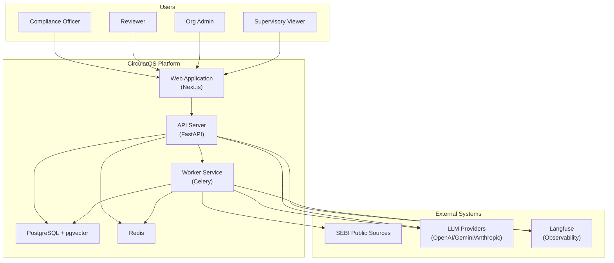
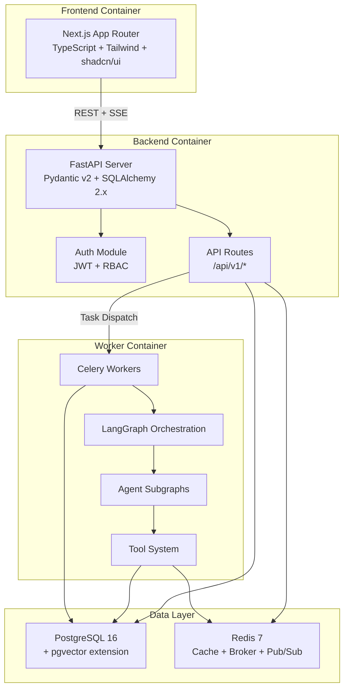
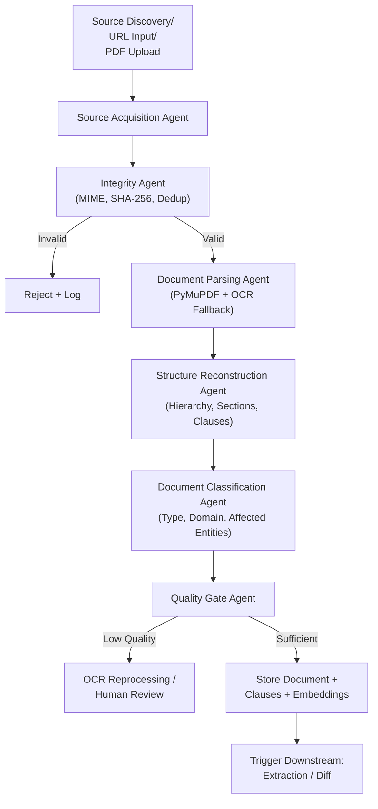
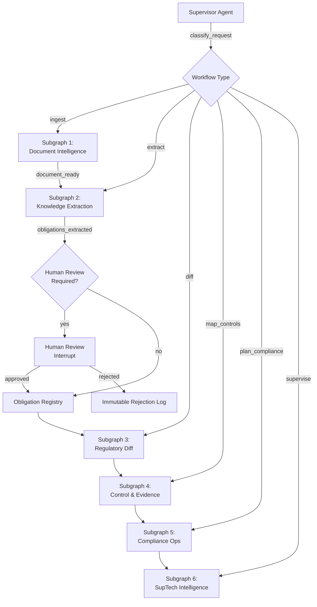
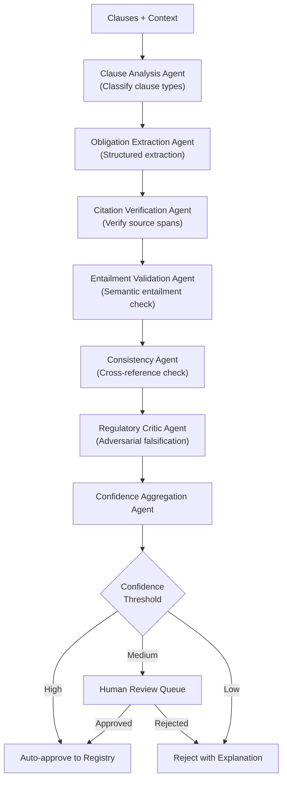
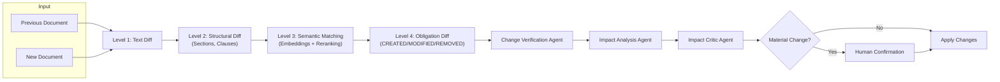
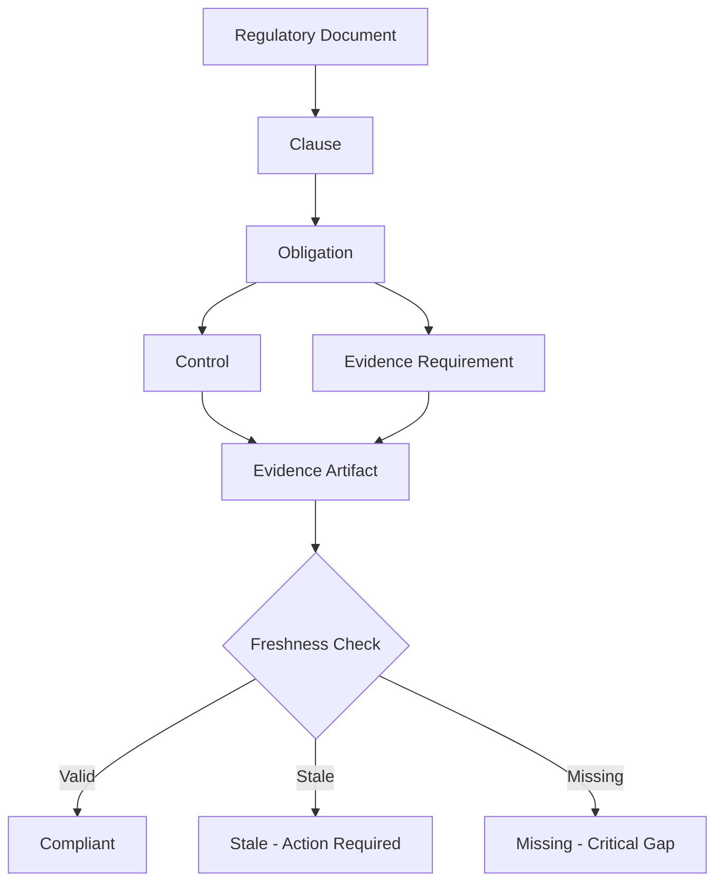
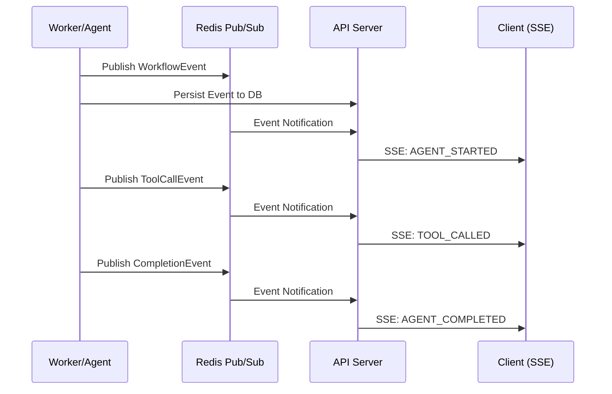
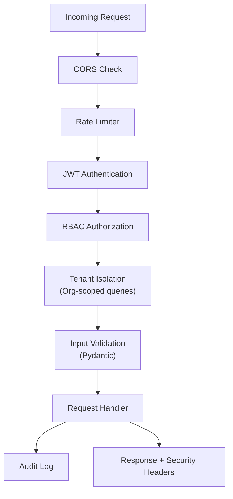

# CircularOS Architecture

## Agentic Regulatory Intelligence, Compliance Operations, and Supervisory Technology Platform

---

## 1. System Context



## 2. Container Architecture



## 3. Monorepo Structure

```
CircularOS/
├── apps/
│   ├── web/                    # Next.js frontend
│   │   ├── src/
│   │   │   ├── app/            # App Router pages
│   │   │   ├── components/     # React components
│   │   │   ├── lib/            # Client utilities
│   │   │   └── hooks/          # Custom hooks
│   │   ├── public/
│   │   └── package.json
│   ├── api/                    # FastAPI backend
│   │   ├── main.py
│   │   ├── config.py
│   │   ├── routes/
│   │   ├── services/
│   │   ├── middleware/
│   │   └── dependencies.py
│   └── worker/                 # Celery workers
│       ├── main.py
│       ├── tasks/
│       └── config.py
├── packages/
│   ├── ai/                     # LLM abstraction layer
│   │   ├── providers/
│   │   ├── prompts/
│   │   └── routing.py
│   ├── agents/                 # LangGraph agents
│   │   ├── supervisor/
│   │   ├── document_intelligence/
│   │   ├── knowledge_extraction/
│   │   ├── regulatory_diff/
│   │   ├── control_evidence/
│   │   ├── compliance_ops/
│   │   └── suptech/
│   ├── regulatory_core/        # Domain models
│   │   ├── models/
│   │   ├── schemas/
│   │   └── enums.py
│   ├── document_processing/    # PDF parsing pipeline
│   │   ├── acquisition.py
│   │   ├── integrity.py
│   │   ├── parser.py
│   │   ├── ocr.py
│   │   └── structure.py
│   ├── retrieval/              # RAG system
│   │   ├── embeddings.py
│   │   ├── search.py
│   │   ├── reranker.py
│   │   └── hybrid.py
│   ├── knowledge_graph/        # Graph operations
│   │   ├── repository.py
│   │   └── queries.py
│   ├── evaluation/             # Eval framework
│   │   ├── runner.py
│   │   ├── metrics.py
│   │   └── datasets.py
│   ├── observability/          # Tracing & logging
│   │   ├── tracing.py
│   │   ├── logging.py
│   │   └── metrics.py
│   └── shared_types/           # Shared Pydantic models
│       ├── events.py
│       └── common.py
├── infra/
│   ├── docker/
│   │   ├── Dockerfile.api
│   │   ├── Dockerfile.worker
│   │   └── Dockerfile.web
│   └── migrations/
│       ├── env.py
│       └── versions/
├── data/
│   ├── goldsets/
│   └── evaluation/
├── scripts/
│   ├── setup.sh
│   └── seed_demo.py
├── tests/
│   ├── unit/
│   ├── integration/
│   ├── api/
│   └── e2e/
├── docker-compose.yml
├── .env.example
├── pyproject.toml
├── README.md
├── ARCHITECTURE.md
├── IMPLEMENTATION_PLAN.md
├── DECISIONS.md
├── TASKS.md
├── SECURITY.md
├── EVALUATION.md
└── DEMO.md
```

## 4. Document Ingestion Pipeline



## 5. LangGraph Supervisor Architecture



## 6. Obligation Extraction Subgraph



## 7. Regulatory Diff Pipeline



## 8. Evidence Lineage



## 9. Real-Time Event Architecture



## 10. Security Architecture



## 11. Key Architectural Decisions

| Decision | Choice | Rationale |
|----------|--------|-----------|
| Background Processing | Celery + Redis | Lower operational complexity than Temporal for initial deployment |
| Knowledge Graph | PostgreSQL relational tables | Avoid Neo4j dependency; graph abstraction allows future migration |
| Vector Store | pgvector | Single database, reduced operational overhead |
| Auth | JWT with refresh tokens | Stateless, standard, well-supported |
| Real-time | SSE | Simpler than WebSocket for uni-directional event streams |
| Monorepo | Python packages + Next.js | Clean separation, shared types via OpenAPI |

## 12. Scaling Strategy

- **Horizontal**: Celery workers scale independently
- **Database**: Read replicas, connection pooling (pgbouncer)
- **Cache**: Redis cluster for high-throughput caching
- **Search**: pgvector with IVFFlat/HNSW indexes
- **Frontend**: CDN + ISR for static content
- **Agent Pipelines**: Parallel subgraph execution via Celery task groups

## 13. Failure Modes

| Component | Failure Mode | Mitigation |
|-----------|-------------|------------|
| LLM Provider | Timeout/Rate Limit | Retry with backoff, provider fallback chain |
| Document Parsing | Corrupt PDF | Integrity check, OCR fallback, quality gate |
| Agent Pipeline | Infinite Loop | Bounded iteration limits, execution timeouts |
| Database | Connection Exhaustion | Connection pooling, health checks |
| Worker | Process Crash | Celery acks_late, idempotent tasks, checkpointing |
| Embedding | Dimension Mismatch | Provider-specific dimension config, validation |
