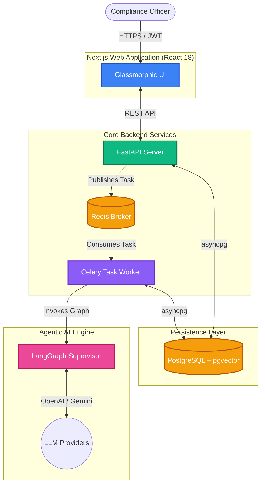
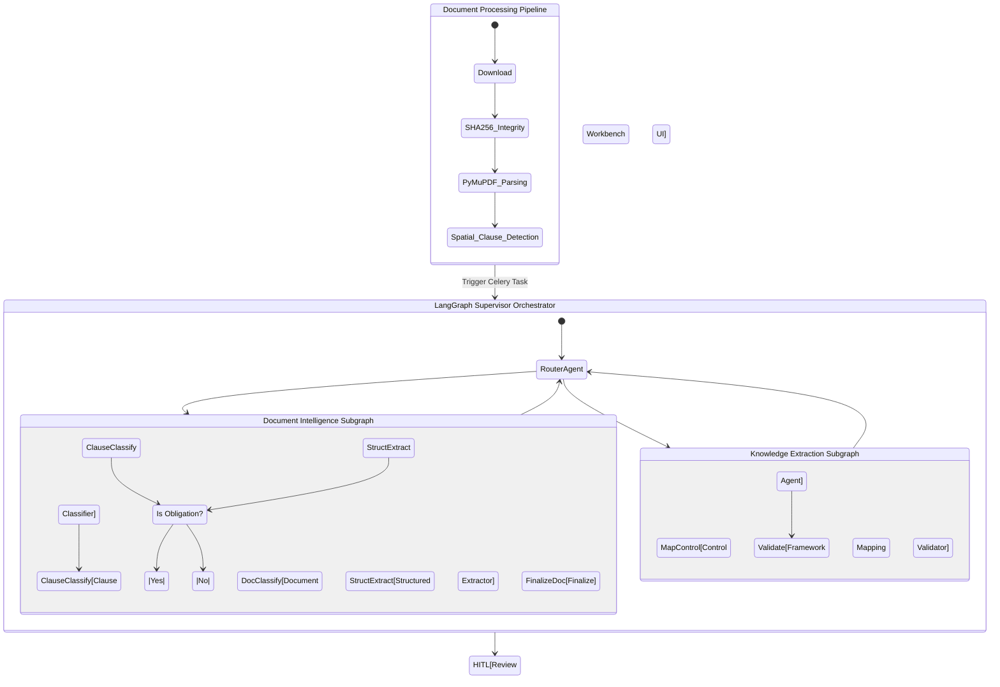

<div align="center">
  
  <h1>CircularOS</h1>
  <p><strong>Next-Generation Agentic RegTech & SupTech Platform</strong></p>
  <p><i>Turning regulatory chaos into structured, actionable intelligence.</i></p>

  <p>
    <a href="#-the-problem">Problem</a> •
    <a href="#-the-solution">Solution</a> •
    <a href="#%EF%B8%8F-architecture-design">Architecture</a> •
    <a href="#-agentic-ai-workflow">Agentic AI</a> •
    <a href="#-tech-stack">Tech Stack</a>
  </p>
</div>

---

## 🚨 The Problem
The Indian Securities Market (regulated by SEBI, RBI, NSE, BSE) releases hundreds of complex circulars and master directions annually. Currently, compliance teams manually read PDFs, decipher legal jargon, and manually map obligations to internal controls. This process is:
- **Slow & Error-Prone**: Leading to multi-million dollar fines for non-compliance.
- **Unscalable**: As the regulatory velocity increases, human analysts cannot keep up.
- **Siloed**: Disconnect between the regulators (SupTech) and the regulated entities (RegTech).

## 💡 The Solution
**CircularOS** is an autonomous AI-driven platform that ingests unstructured regulatory PDFs and uses a sophisticated **Multi-Agent LangGraph architecture** to parse, classify, and extract highly structured, machine-actionable compliance obligations.

It features a **Human-in-the-loop (HITL)** Review Workbench for compliance officers to verify AI extractions before they are mapped to internal controls via our Knowledge Extraction Graph.

---

## 🏗️ Architecture Design

CircularOS is built on a highly scalable, event-driven microservice architecture, allowing the heavy AI processing to happen asynchronously without blocking the frontend.



### Key Architectural Highlights
- **Monorepo Structure**: Unified Python (Backend) and TypeScript (Frontend) repository.
- **Asynchronous Data Layer**: `asyncpg` combined with SQLAlchemy 2.0 ensures massive concurrent I/O throughput.
- **Time-sortable UUIDv7**: Primary keys are optimized for database index clustering while preventing sequence prediction.
- **Circuit Breakers**: Advanced `tenacity` retry logic ensures the pipeline survives rate limits and LLM provider outages.

---

## 🤖 Agentic AI Workflow

We moved beyond basic "wrapper" prompting. CircularOS utilizes **LangGraph** to build a stateful, cyclical graph of AI agents that independently verify and cross-reference information.



### 1. Document Intelligence Subgraph
- **Parser**: PyMuPDF analyzes exact font sizes and bold attributes to dynamically reconstruct heading hierarchies, rather than blindly chunking text.
- **Fast Classifiers**: `gpt-4o-mini` batches clauses to determine if they contain actionable duties.
- **Reasoning Extractor**: `gpt-4o` extracts Actor, Action, Object, Deadline, and Risk Level, mapping them explicitly back to exact text citations.

### 2. Knowledge Extraction Subgraph
- Maps the unstructured obligations to established internal controls (e.g., ISO 27001, SOC2) via semantic reasoning.

---

## 💻 Tech Stack

| Category | Technology |
|----------|-----------|
| **Frontend UI** | Next.js 14, React 18, Tailwind CSS v4, Lucide Icons (Glassmorphic dark mode) |
| **Backend API** | FastAPI, Python 3.12, Uvicorn |
| **AI Orchestration** | LangGraph, LangChain, OpenAI, Google Gemini |
| **Database** | PostgreSQL 16, pgvector, SQLAlchemy 2.0, asyncpg |
| **Task Queue** | Celery, Redis 7 |
| **Document Proc.**| PyMuPDF (fitz), Tesseract OCR |
| **DevOps** | Docker, Docker Compose, Alembic |

---

## 🏆 Why CircularOS Wins

1. **Technical Excellence**: It’s not just an API wrapper. It uses true autonomous agent orchestration (LangGraph), distributed task queues (Celery), and async Python architectures suitable for enterprise scale.
2. **Deep Domain Expertise**: The data models perfectly mirror compliance realities (RBAC, Audit Logs, Soft-deletion, Control Libraries).
3. **Flawless UI/UX**: A stunning, premium aesthetic featuring micro-animations, split-pane document reviews, and live agent tracing.
4. **Immediate Market Applicability**: A massive pain point for any financial institution. The dual RegTech (for brokers/banks) and SupTech (for SEBI/RBI) capability creates a holistic ecosystem.

---

## 🚀 Quick Start

```bash
# 1. Clone the repository
git clone https://github.com/priteshvirat24/CircularOS.git
cd CircularOS
cp .env.example .env # Add your OPENAI_API_KEY

# 2. Start core infrastructure
docker compose up -d postgres redis

# 3. Setup Backend
python3 -m venv .venv
source .venv/bin/activate
pip install -e ".[dev]"
alembic upgrade head
uvicorn apps.api.main:app --reload --host 0.0.0.0 --port 8000

# 4. Start Background Worker
source .venv/bin/activate
celery -A apps.worker.main worker --loglevel=info

# 5. Start Frontend
cd apps/web && npm install && npm run dev
# Open http://localhost:3000
```
